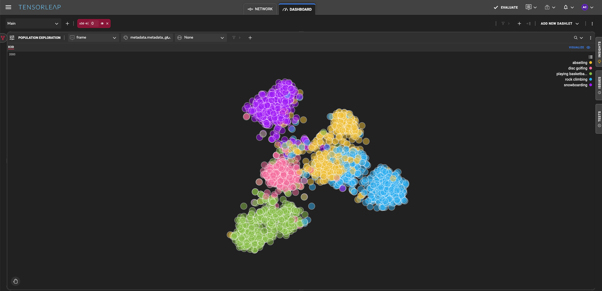
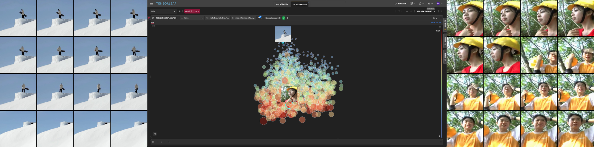
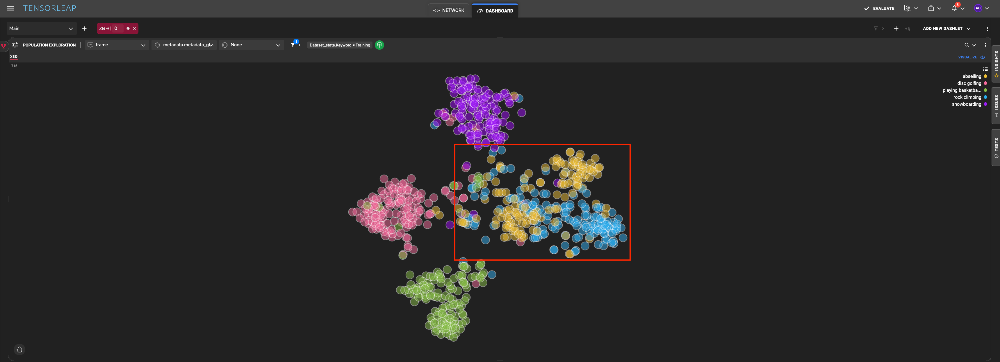
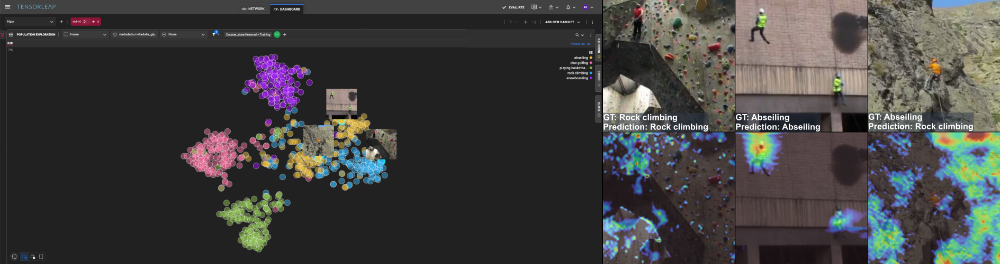
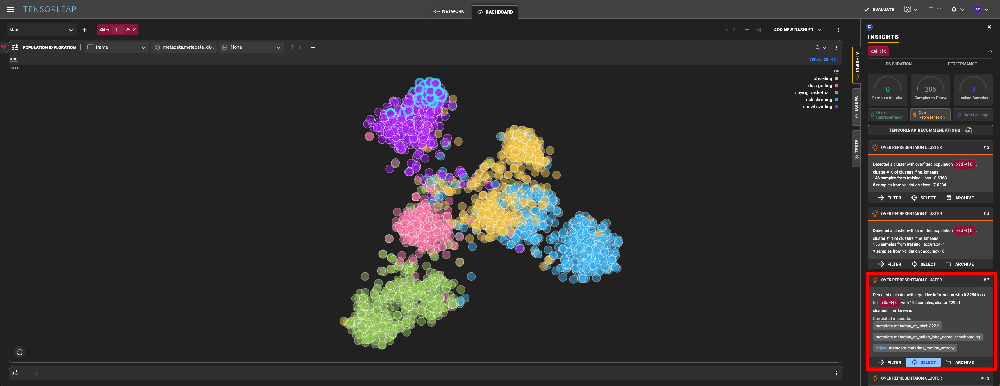
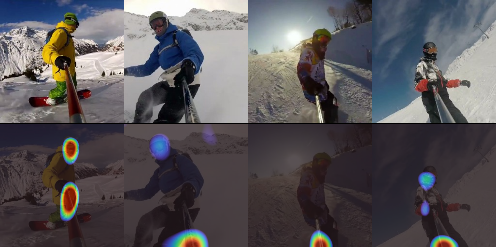
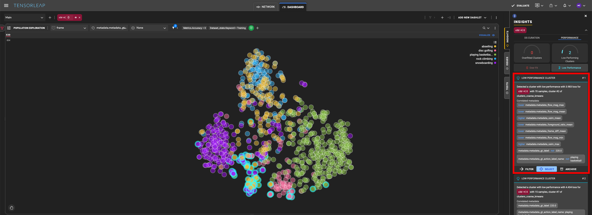
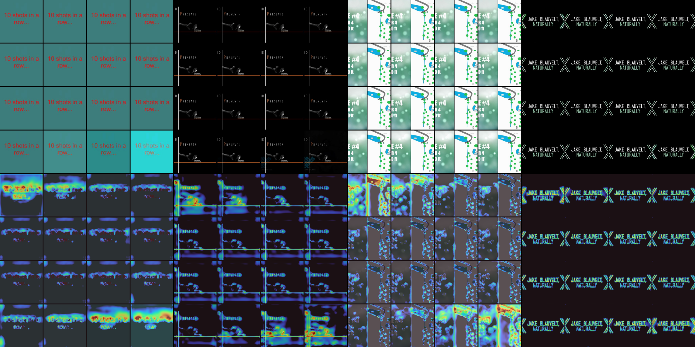

# Action Recognition Using the Kinetics-400 Dataset

  
  <figcaption><em>Figure 1: Tensorleap’s latent space.</em></figcaption>

## Introduction
Video classification is a common and complex area in machine learning. Unlike other vision tasks that contain only spatial information (Segmentation, Object Detection, Mono-Depth), the addition of the temporal dimension makes error analysis and pinpointing failures root-cause especially challenging.

In this blog, we explore that challenge through the lens of **Tensorleap**, a powerful platform for visualizing and interpreting deep learning models. We will use Tensorleap to peer inside the mind of a video classifier.

Along the way, we’ll use Tensorleap’s explainability engine to explore concepts in the data, balance the dataset, and characterize failures. By the end, you’ll understand how Tensorleap can be used not just to **interpret model outputs**, but to actively **debug and improve** your video classification pipelines.
## Dataset
For this exploration, we turned to [Kinetics-400](https://arxiv.org/pdf/1705.06950) - a widely-used dataset from DeepMind featuring around **240,000** short video clips, each labeled with one of **400 human action classes**. These videos, originally sourced from YouTube, serve as a rich and diverse benchmark for human activity recognition.

To keep our analysis focused, we limited our scope to five classes: **abseiling, disc golfing, playing basketball, rock climbing, snowboarding.**
## Model
To tackle video classification, we used  [X3D](https://arxiv.org/pdf/2004.04730)  from FAIR’s [PyTorchVideo](https://pytorchvideo.org/) library. X3D is a lightweight 3D convolutional network designed specifically for efficient video classification. It is designed to strike a balance: capture the rich **spatiotemporal patterns** in video clips while keeping computational costs low.

For this experiment, we used the **medium-sized variant** of X3D, which packs around **40 million parameters** and achieves **74.6% top-1 accuracy** on Kinetics-400.

Each input to the model consists of **16 frames at 256×256 resolution**, representing the **first 2 seconds** of a video. The output is a prediction across all 400 action classes. Note: while we limited our analysis to a subset of five classes for interpretability and focus, the model itself still performs classification across the full set of 400 Kinetics labels.
***
## Latent Space Exploration
One of Tensorleap’s most powerful features is its ability to extract and visualize a model’s **latent space** - not just the output of the last layer, but a smart, high-dimensional representation of how the model internally understands each video.

Using dimensionality reduction (PCA or t-SNE), Tensorleap projects this latent space into an interactive 2D panel that can be used to explore the dataset. Figure 1 shows the five selected action classes formed **distinct clusters**, suggesting that the model has learned strong semantic separations between them.
### Latent Space Semantics
Once we had the latent space mapped out, we used Tensorleap to dig deeper - not just into class clusters, but into **semantic patterns** within those clusters.

One of the metadata fields we explored was the **foreground–background ratio**, which Tensorleap automatically extracts from each video. This metadata estimates how much of each frame is occupied by the moving subject (foreground) versus the surrounding environment (background), then averages that across the video.

When we colored the latent space based on this ratio, a new pattern emerged: samples with **low foreground–background ratios** appeared in one region, while those with **high ratios** clustered elsewhere (Figure 2). In other words, the latent space wasn’t just separating classes - it was also organizing samples based on internal visual characteristics.

To illustrate, Figure 2 presents two video samples (16 frames presented as a 4x4 grid) from opposite ends of the latent space:
* **Low foreground–background ratio (upper region) - Left side:** The subject occupies a small portion of the frame.

* **High foreground–background ratio (lower region) - Right side:** The moving people take a large portion of the frame

  
  <figcaption><em>Figure 2: The latent space presents the distribution of the foreground-background ratio. Small blue circles and big red circles represent samples with low and high foreground movement, respectively. Two samples are included - on the left: low foreground movement mean. On the right: high foreground movement.</em></figcaption>

### Similar Class Confusion
Some action classes are just visually similar, even to humans. For example, in our case: **Rock Climbing** and **Abseiling**. Both involve vertical surfaces, ropes, harnesses, and often very similar environments. Not surprisingly, these two classes ended up **close together in latent space** - and even partially overlapping in some regions (Figure 3).

  
  <figcaption><em>
Figure 3: Latent space presenting only samples from validation and test sets, colored by GT label. Even though the rock climbing and abseiling classes are distinct, it can be observed that there is an overlap.
</em></figcaption>

To illustrate what the latent space represents, Figure 4 presents three samples (showing the key frame from each sample). Two samples are from the distinct class areas and one is from the class-mixed area.

Figure 4 (right part) presents Tensorleap’s **Heatmaps** along with the corresponding images, to show where the model focused when making predictions. The heatmaps reveal that the model’s focus areas are consistent with logical visual cues. In the distinct class samples (left and middle columns), the model attends to the correct features - for the rock climbing example, it concentrates on wall textures and body positioning; for the abseiling example, it focuses on ropes and harnesses. However, in the sample from the class-mixed region (right column), the model primarily fixates on the surrounding rocks, explaining why it confuses abseiling with rock climbing.

This analysis suggests that **proximity in the latent space often mirrors visual and contextual similarities**, and that Tensorleap’s tooling allows us to zoom into both cluster-level structure and sample-level model reasoning.

  
  <figcaption><em>
Figure 4: Left part presents the three samples in the latent space. Bottom right is from distinct Rock Climbing area in the latent space, top is from distinct Abseiling area, and bottom left is from the borderline. Right part presents the samples with their corresponding heatmaps. From left to right: clearly clustered rock climbing sample, clearly clustered abseiling sample, borderline region. Clearly clustered samples heatmaps show relevant features while the borderline does not.
</em></figcaption>

***
## Tensorleap’s Insights
Tensorleap doesn’t just help visualize what a model is doing - it actively highlights **where** things might be going wrong. By analyzing the structure of the **latent space**, Tensorleap automatically flags clusters that might signal issues like **overfitting**, **low accuracy**, or **repetitive data**. Even better, it correlates these problem areas with automatically extracted metadata, offering a quick way to get an hypothesis for the root cause of the issue.
### Insight: Over-Represented Cluster
One of the insights Tensorleap highlighted is the existence of a cluster with redundant information - a group of samples that were unusually dense in latent space. Insight number 7 flagged this cluster which contains **122 samples**.

  
  <figcaption><em>
Figure 5: Insight presented in Tensorleap’s dashboard. Insight description is on right hand size (red box), including the correlated metadata, and effected samples have a highlighted circumference.

</em></figcaption>

The model achieves notably higher accuracy on this particular cluster - 92.6% compared to the dataset-wide average of 78.5%. At first glance, this suggests strong performance. However, a closer look at the cluster’s content tells a different story.

Tensorleap insight indicate that this cluster primarily consists of samples from the “snowboarding” class. Visual inspection of the cluster reveals that many of these clips feature **snowboarders filming themselves with selfie sticks** (Figure 6 - top row), resulting in a set of videos that are **visually and semantically repetitive**: same camera angles, same movement, same framing.

This redundancy in the data raises questions about what the model is actually learning. Tensorleap’s **Sample Analysis tool** provides key insights here. The generated heatmaps, that are generated with respect to the snowboarding class, consistently **highlight the selfie stick** as a focal point in the model’s decision-making process (Figure 6 - bottom row). In other words, the model may be performing well - but for the wrong reasons.

Such overfitting to a specific visual cue can hurt generalization. If the model has learned to associate snowboarding with the presence of a selfie stick, it may struggle to correctly classify snowboarders in more varied, realistic contexts - particularly those without selfie sticks.

This insight showcases how Tensorleap’s layered analysis - from latent structure to visual inspection and attention heatmaps - can reveal subtle forms of overfitting that might otherwise go unnoticed, helping ensure models will learn features that supports generalization.

  
  <figcaption><em>
Figure 6: Top row presents visually and semantically repetitive samples from the inspected cluster, while the bottom row presents the corresponding heatmaps generated with Tensorleap’s Sample Analysis tool.
</em></figcaption>

### Insight: High Loss Cluster
Looking only at **misclassified training samples**, Tensorleap highlighted a cluster of samples with **high loss** values. This “low performance” cluster made up about **8.4%** of the filtered set.

  
  <figcaption><em>
Figure 7: Latent space filtered to misclassified training samples only. Insight description is on right hand size (red box) and effected samples have a highlighted circumference.
</em></figcaption>

The **cause** of low performance wasn’t immediately obvious - but Tensorleap pointed us in the right direction. The platform automatically correlated this cluster with several metadata fields. Two in particular stood out (5th and 7th row in the red box in Figure 7):

* **SSIM mean** - a measure of visual similarity between consecutive frames.

* **Frame diff mean** - the average pixel-level difference between frames.

In this cluster, **SSIM was high** and **frame difference was low**, meaning that the videos had little variation over time. In other words, these samples might be **visually static** - showing minimal motion or scene change between frames.

That led us to come up with a hypothesis: these videos might not have enough visual signal for the model to work with. And indeed, visual inspection of the cluster confirmed it - many samples consisted of an **almost static background with some text** (Figure 8 top row).

Tensorleap’s heatmaps backed this up. The model focused on the only features the clip had, but those areas were static and uninformative for the task (Figure 8 bottom row). These findings reinforce the value of automated insights: the model struggles not due to semantic ambiguity, but due to **lack of sufficient visual signal** in the data.

Here we can see a classical use of Tensorleap’s error analysis flow: The insight flagged the issue, metadata correlations pointed us toward a lack of visual signal, and heatmaps confirmed the model’s attention on static, uninformative areas - Tensorleap provided us with all the information we need to identify, charactarize, and then solve the issue that was flagged.

  
  <figcaption><em>
Figure 8: Top row: video frames grid, bottom row: corresponding heatmaps (red is more attention). All these samples were misclassified. GT are (left to right): basketball, rock climbing, disc golfing, snowboarding.
</em></figcaption>

## Wrapping Up
Building robust video classifiers goes far beyond reaching high accuracy. Tensorleap takes you beyond metrics, revealing why your video classifier fails - and how to fix it. Whether it’s overfitting to a selfie stick, mixing up similar actions, or struggling with empty frames, Tensorleap surfaces the root causes behind your model’s behavior and provides actionable items.

In this post, we explored how seemingly strong performance can mask critical weaknesses, such as overfitting to redundant visual cues like selfie sticks. With Tensorleap, these issues surface early in the development cycle. By leveraging tools like Sample Analysis, latent space visualization, and heatmap overlays, teams can pinpoint failure modes, balance datasets, and avoid blind spots that would otherwise emerge in production.

Tensorleap shortens model development time by surfacing root causes of error and suggesting actionable improvements. Instead of spending weeks manually debugging performance drops, teams can quickly iterate on both models and data. The result: fewer surprises in production, better generalization, and more trustworthy AI systems.
## Next Steps
* Curious how you can benefit from Tensorleap? [Reach out for a demo](https://tensorleap.ai/request-demo/).
* Want to explore this Tensorleap use-case yourself? [Check out our implementation](https://github.com/Tensorleap-hub/video-classification).